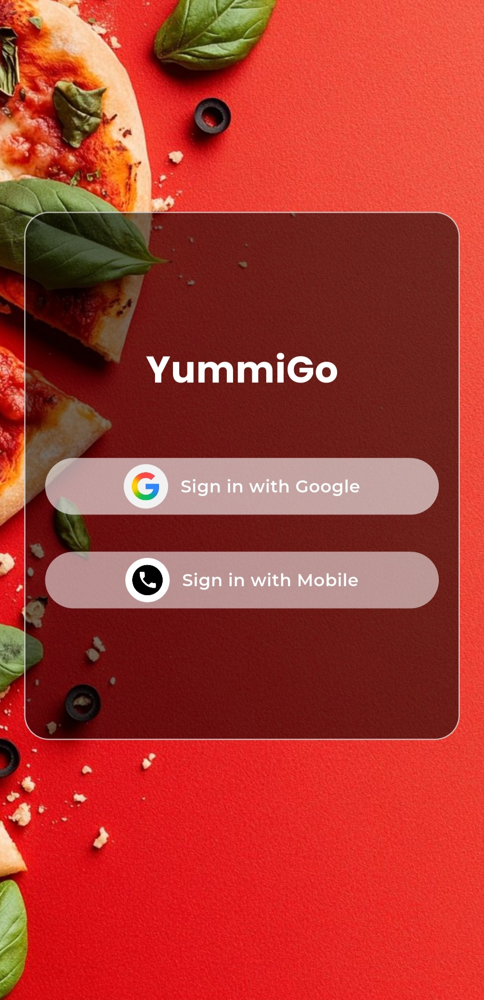
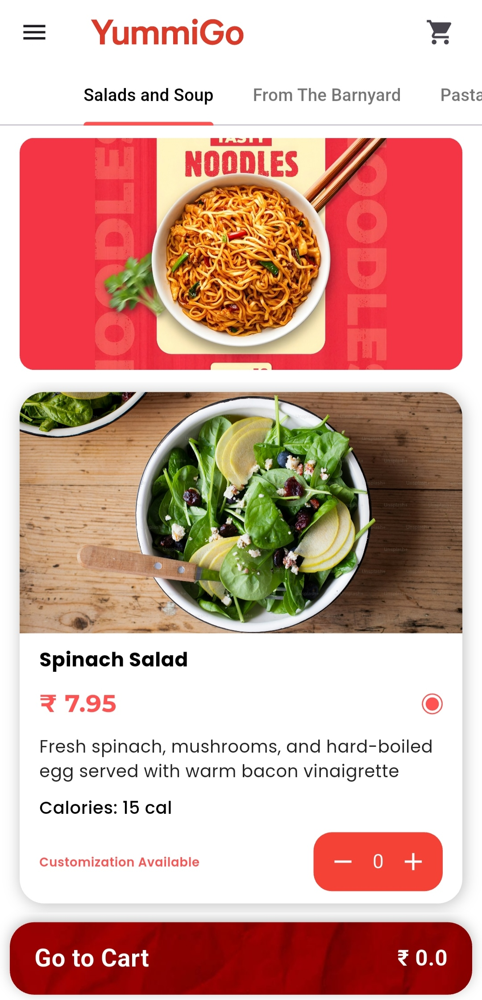
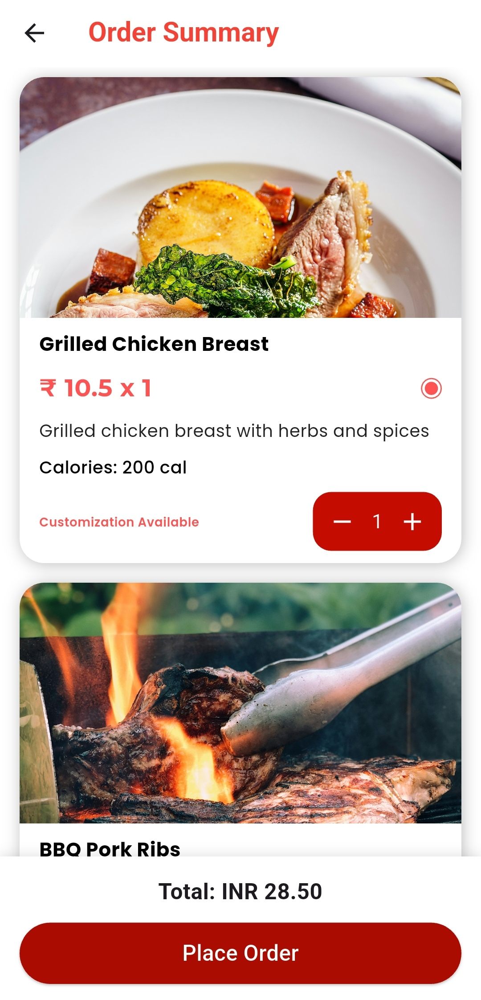
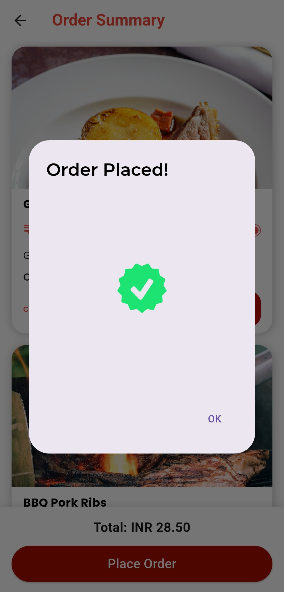

# 🍽️ YummiGo — Flutter Machine Test (Zartek)

A fully functional food ordering mobile app built using **Flutter**, completing the Zartek machine test requirements.  
The app includes **Google Authentication**, **Menu API integration**, **Category-based UI**, **Cart system**, **Checkout flow**, and **clean Provider-based state management**.

This project also includes several **extra features beyond the assignment requirements**, making the UI smoother, cleaner, and more production-ready.

---

## 🚀 Features Implemented

### ✅ 1. Google Sign-In Authentication
- Secure login using Google OAuth  
- Stores session to avoid repeated logins  
- Logout functionality included  

---

### ✅ 2. Splash Screen + Onboarding Flow
- Custom animated splash screen  
- Smooth fade transition  
- Onboarding screens introducing app features  

---

### ✅ 3. Menu API Integration

Fetched data from:  
`https://faheemkodi.github.io/mock-menu-api/menu.json`

Includes:
- Categories  
- Dishes list  
- Addons  
- Calories  
- Veg/Non-Veg indicators  
- Customization availability  

---

### ✅ 4. Home Screen (Dynamic UI)
- Tab bar showing all categories  
- Horizontal scrolling category tabs  
- Dish tiles for each category with full details  
- High-quality images & clean UI  

---

### ✅ 5. Cart System (Provider State Management)
- Add to cart  
- Remove from cart  
- Increase/decrease quantity  
- Prevent duplicate items  
- Dynamic total price calculation  
- Real-time cart updates  

---

### ✅ 6. Checkout Screen
- Order summary with quantity updates  
- Lottie animations  
- Success pop-up with cart clearing  

---

## 🔥 Additional Features Added (NOT part of requirement)

| Feature | Description |
|--------|-------------|
| ⭐ Elegant UI Enhancements | Used Google Fonts, custom tiles, shadows, rounded cards |
| ⭐ Lottie Animations | Added empty cart + success animations |
| ⭐ Profile Drawer | Shows user info + logout button |
| ⭐ DishTile Component | Clean reusable widget for dish UI |
| ⭐ API Error Handling | Prevents crashes if API fails |
| ⭐ Provider Architecture | Clear separation of logic (MVC-like) |
| ⭐ Animated Transitions | Smooth splash → onboarding → home |
| ⭐ Veg / Non-Veg Indicators | Professional restaurant-style icons |
| ⭐ Addons/Customization Ready | Designed for future upgrades |

---

## 🛠️ Tech Stack

| Technology | Purpose |
|-----------|---------|
| **Flutter** | App development |
| **Dart** | Programming language |
| **Provider** | State management |
| **Google Sign-In** | Authentication |
| **HTTP package** | API calls |
| **Lottie** | Animations |
| **Google Fonts** | Modern, clean typography |

## 📸 App Screenshots

### Splash Screen

### Onboarding

### Authentication Screen

### Home Screen

### Cart

### Checkout

